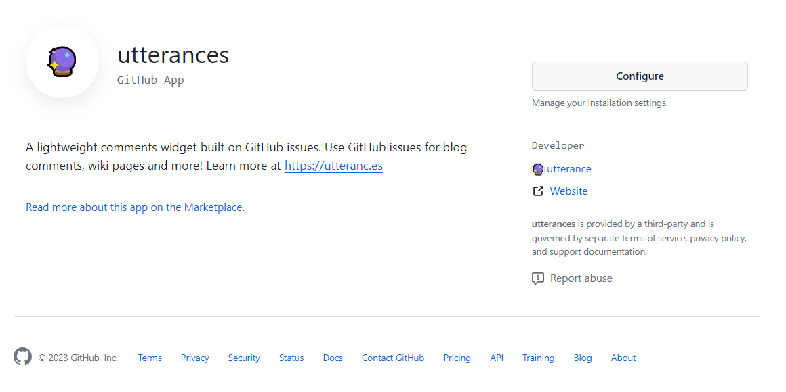
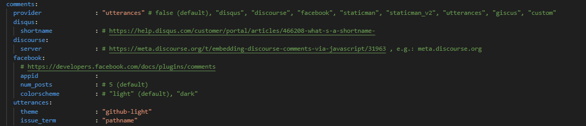
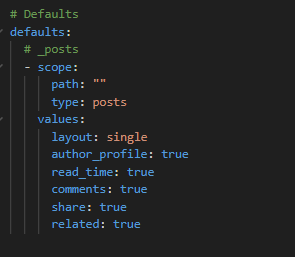
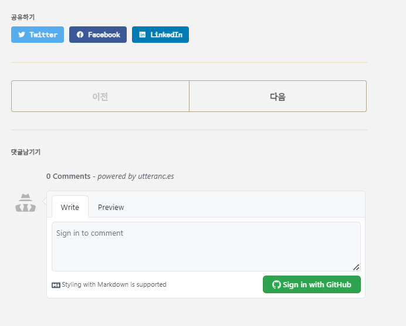

깃허브 블로그에 댓글을 달 수 있도록 해보겠습니다. 

## 🔮utterances 적용하기
제가 사용하고 있는 minimal-mistakes 테마 경우 _config.yml 파일에 utterances를 적용할 수 있는 코드가 존재합니다. 

1. 먼저 Github App에서 [Utterances](https://github.com/apps/utterances)를 설치합시다!

{: width="600"height="300"}
> ❗제 경우에는 이미 설치가 되어있기 때문에 Configure이라고 써있는것이지만 여러분은 Install버튼이 있을겁니다!

Install 버튼을 누른 후 내리다보면 여러 설정들이 보입니다. 
저는 굳이 utterances 레포지토리를 만들고 싶지 않았기 때문에 현재 블로그를 만들고 있는  kkiwiio.github.io 레포지토리를 저장소로 설정하였습니다. 

{: width="500"height="300"}

이슈 라벨이나 테마 설정을 해준 후
내려가다보면 script가 보이게 됩니다.  이 script를 잘 기억해주세요

## 🔮utterances minial-mistakes에 적용하기
minimal-mistakes 테마의 경우 모든 설정옵션이 _config.yml 파일에 존재합니다. 
해당 파일을 열어 commets 옵션을 설정해줍시다.
{: width="600"height="150"}

**✨중요**  _config.yml 파일을 아래로 쭉 내리다보면 defaults 부분이 존재합니다
이 부분에서 comments 부분을 꼭 true로 설정해주세요
{: width="400"height="240"}

이제 다 되었다면 Github에 push해주면 됩니다!

{: width="500"height="300"}

잘 적용되었습니다!